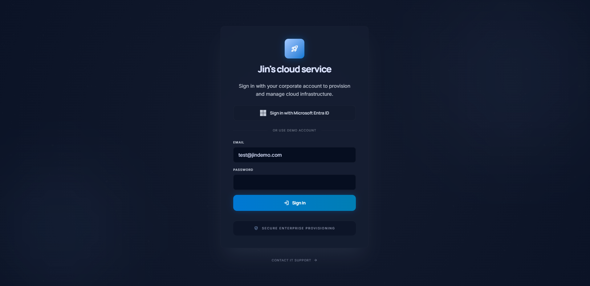
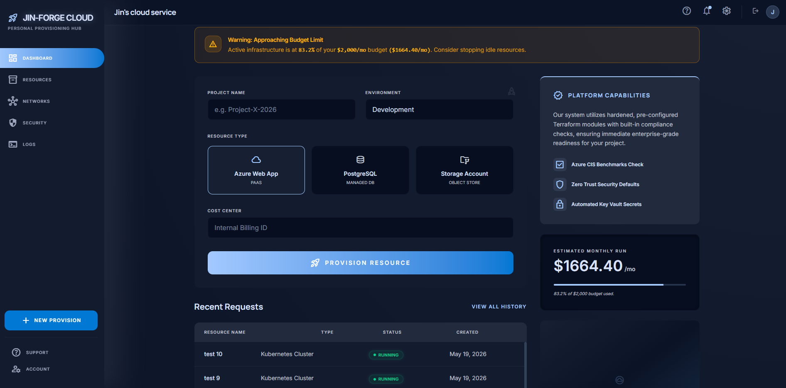
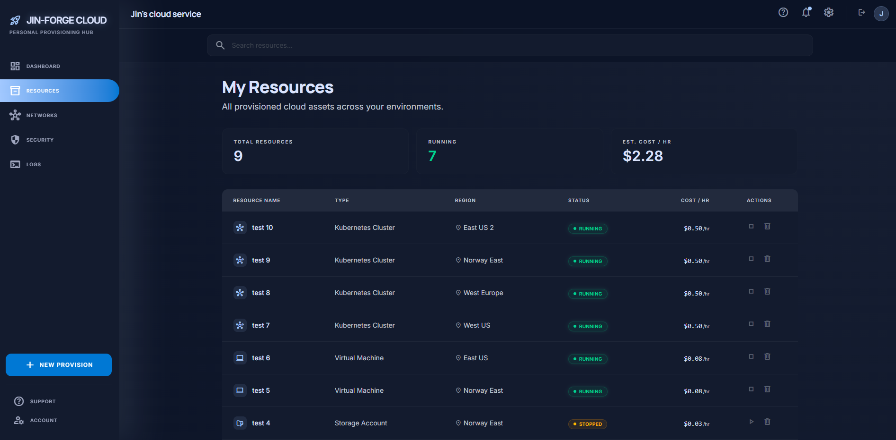

# Jin Forge Cloud

A modern cloud resource management dashboard designed to provision, track, and manage virtual infrastructure. Built as a Single Page Application (SPA) utilizing a component-driven architecture with an emphasis on optimized data rendering, responsive layouts, and secure access gates.

## Live Deployment and Access

* **Production URL:** [[DEMO](https://salmon-meadow-0d0db7710.7.azurestaticapps.net/)]

The internal metrics and provisioning database are secured behind an authentication wall to mitigate automated request spam. Reviewers can access the live dashboard using the following demo credentials:

* **Authentication Identifier:** test@jindemo.com
* **Access Passphrase:** 

## Core Features

* **Role-Based Access Control Simulation:** 
Integrated end-to-end authentication flows utilizing Supabase Auth (GoTrue framework) and state-driven protected routing patterns.

* **Continuous Integration & Automated Deployment:** 
Configured fully automated CI/CD deployment pipelines using GitHub Actions runners, integrated with Azure Static Web Apps.

* **Optimized Data Layer Performance:** 
Implemented dynamic vertical scrolling viewports within dense data environments using Tailwind CSS WebKit utility variants, featuring pinned context headers for continuous structural visibility.

* **State-Driven Single Page Architecture:** Developed zero-latency internal navigation layers bypassing browser-level document requests to preserve underlying application memory.

* **Real-Time Data Query Processing:** Built asynchronous filter matrices enabling instantaneous evaluation of live provisioned asset registries.

* **Real-Time Budget alert notification and live progression:** 
Built-in alert and notification systems upon reaching a threshold for financial budget.

## Interface Specifications

### Secure Authentication Gateway
*Corporate-style Single Sign-On simulation interface featuring error handling and secure password entry isolation.*


### Management Console Dashboard
*Aggregated cloud architecture oversight panel providing instantaneous system metrics and localized transaction records.*


### Asset Provisioning and Inventory
*Scrollable data matrix containing the complete execution history of provisioned cloud assets with integrated keyword querying.*


## System Architecture and Tech Stack

The workspace operates on a decoupled structure separating dependencies across runtime environments:

* **Client Layer:** React 18, Vite Bundler (Located in `/frontend`)
* **Styles Engine:** Tailwind CSS (Utility-first, compiled inline layout design)
* **Backend Database & Identity Provider:** Supabase (PostgreSQL, Client-side API integration)
* **Hosting Network:** Azure Static Web Apps (Distributed Global Edge CDN nodes)
* **Deployment Automation:** GitHub Actions CI/CD (Compiles dependencies and injects build-time VITE environment variables)

## Local Installation and Execution

To deploy a local development server, replicate the environment using the following sequences:

1. Target the application directory:
```
cd frontend
```

2. Provision localized package dependencies:
```
npm install
```

3. Configure environmental secrets:
Create a .env file within the /frontend directory containing your active Supabase endpoints:
```
VITE_SUPABASE_URL=your_supabase_project_url
VITE_SUPABASE_ANON_KEY=your_supabase_anonymous_key
```

4. Execute the local compilation process:
```
npm run dev
```
